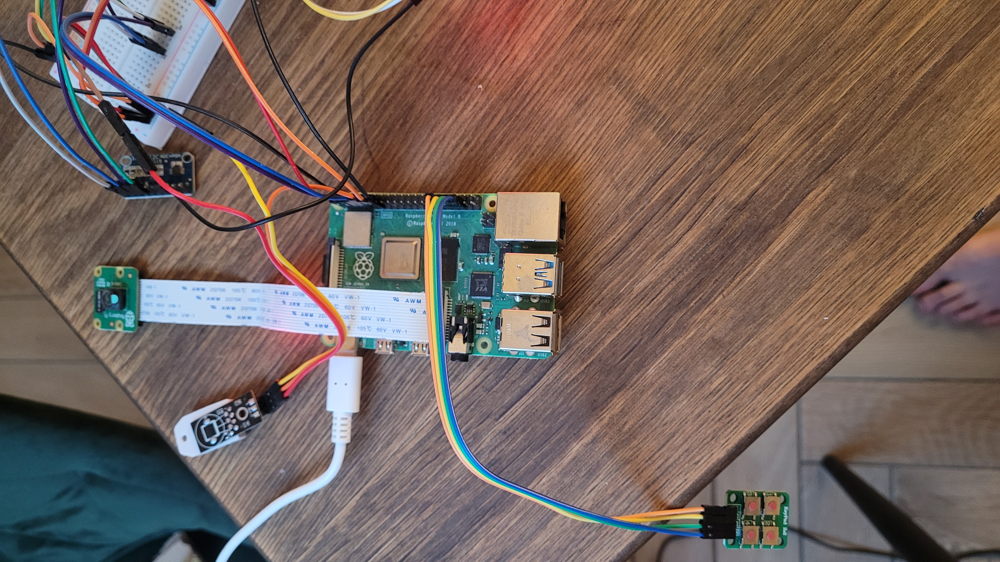
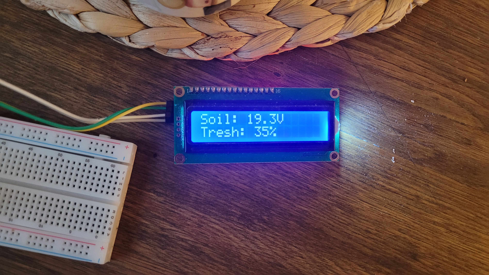

# PlantPi

PlantPi is an automated plant monitoring and watering system built around a **Raspberry Pi 4B**.

The system monitors soil moisture, temperature and air humidity, automatically controls a water pump, captures plant images and provides a local interface through a **16x2 LCD and keypad**. Sensor data is continuously logged and used to generate daily summaries and timelapse videos.

The project was built as a complete hardware-software prototype, combining sensor acquisition, GPIO control, image processing, automation and data logging.

## Key Features

- Automatic watering based on calibrated soil moisture measurements
- Analog soil sensor acquisition using an **ADS1115 16-bit ADC**
- Temperature and humidity monitoring using **DHT22**
- Water pump control through **GPIO and an external MOSFET**
- Local **LCD + keypad** user interface with AUTO/MANUAL modes
- Raspberry Pi Camera with automatic image capture and light estimation
- CSV sensor logging and soil calibration data collection
- Automatic daily **H.264 timelapse generation using FFmpeg**
- Automated daily email reports
- Background processes and automatic startup managed with **systemd**

## Hardware

`Raspberry Pi 4B` · `ADS1115` · `DHT22` · `Analog soil moisture sensor` · `Raspberry Pi Camera` · `16x2 I2C LCD` · `4-button keypad` · `MOSFET power switch` · `DC water pump`

## Software

**Python · GPIO · I2C · Adafruit CircuitPython · Pillow · FFmpeg · systemd**

Main application:

```text
controller_v3.py
```

Additional modules handle watering, raw sensor logging, timelapse generation and daily reporting.

## Repository Structure

```text
controller_v3.py         Main controller, sensors and user interface
watering_cycle.py        Automatic and manual watering
soil_voltage_logger.py   Raw soil sensor data logging
make_timelapse.py        Daily timelapse generation
daily_report.py          Daily statistics and email reports
config.json              System configuration
test_*.py                Hardware and subsystem tests
```

## Notes

Soil moisture was calibrated experimentally from multi-day raw voltage measurements. The watering algorithm uses separate dry and wet thresholds and delayed measurements after each pump cycle to account for water distribution through the soil and the sensor's response time.

Generated data, photographs, videos, runtime state and credentials are excluded from the repository.

## Code Notes

The software was developed iteratively alongside the hardware prototype.

The repository contains the main controller together with calibration, logging, testing and automation scripts used during development.

The current structure reflects the final working prototype rather than a later refactor performed only for presentation.


## Prototype

The system was built and tested as a complete physical prototype.

<p align="center">
  
</p>

<p align="center">
  
</p>

<p align="center">
  <a href="lcdMenuDemo.mp4">▶ LCD interface demonstration</a>
</p>
